# Open GL tutorial
#schaban #opengl #tutorial

## Intro
В честь Дня Знаний публикую черновую версию нового OpenGL учебника.
Это в начале было написано в «эпистолярном жанре», теперь я перенёс из e-mail в отдельные документы, сделав текст несколько более нейтральным, но тут ещё необходимо серьёзное редактирование (и форматирование, пока всё выглядит довольно уродливо, так что простите).
Буду помещать тут обновления.

Идея такая — есть уже работающая графическая программа, которая показывает простую, но не отвратительную сцену с анимированными персонажами и относительно детальным фоном.
В этой программе определена модель освещения, материалов и обработки цвета, хотя модель эта несложная, её полное воплощение задача довольно нешуточная.
Однако модуль, отвечающий за отображение сцены, изолирован и доступ с функциям рисования производится через простой абстрактный интерфейс.
Упражнение заключается в написании простейшего модуля рисования. Даётся начальный код, в котором надо «заполнить пробелы» и сопутствующие инструкции.
Когда упражнение пройдено, предположительно возможны дополнительные инструкции, как постепенно довести этот простой вариант до полноценного модуля. (Кроме того, для выполнившего упражнение, самостоятельный разбор кода существующего полного модуля становится относительно посильной задачей.)

В результате получается, как мне кажется, интересное и нетипичное OpenGL упражнение.

Ещё одна цель — помимо OpenGL, это упражнение также даёт начальную информацию относительно использования новых разработок, *crosscore* и *OGLSys*, а также некоторое представление об их возможностях, и, я думаю, может служить хорошим дополнительных материалом, когда эти разработки будут опубликованы. В конце-концов это наверное должно быть опубликовано в виде *github* pages, как часть проекта.

## 0. Краткое описание основных модулей программы.
`crosscore.cpp/.hpp` — основная библиотека, вычислительные функции, работа с памятью, файлами, многозадачностью и прочие системные функции, поддержка форматов данных для работы с графикой и анимацией;

`oglsys.cpp/.hpp` — функции для инициализации и работы с OpenGL под разными OS; 

`scene.cpp/.hpp` — управление объектами в сцене, в целом модуль специфический для этого конкретного примера. Общие функции для управления ресурсами и объектами в сцене находятся в *crosscore*; На заметку: в общем «*ресурс*» означает немутирующие данные, а «*объект*» это экземпляр этого ресурса в сцене; скажем NPC может быть представлен в виде одного ресурса модели и многих экземпляров этой модели в сцене, у этих экземпляров разные трансформации и прочие параметры.

С перечисленными выше модулями мы будем иметь дело только косвенно, но хорошо иметь о них самое общее представление.

`draw.hpp` — тут описан интерфейс для рисования объектов в сцене, наша задача в этом учебнике написать простейшую реализацию этого интерфейса;
`draw_ogl.cpp `— полноценная реализация draw интерфейса; 
`draw_ogl_x.cpp` — заготовка для нашей упрощённой реализации, в этом учебнике будем напрямую работать практически только с этим файлом;

В остальных файлах вспомогательные функции, код для управления парой тестовых сцен и macOS специфические функции.

Эти модули для нас неважны, за небольшим исключением `mac_bridge.cpp`, тут в конце функции `mac_init()` есть вызов `Scene::init(scnCfg) `Перед этим вызовом закомментированный оператор: `scnCfg.drawImplType = 1;`
Это выбирает тип реализации draw интерфейса, если это значение 0, то будет использоваться полноценная версия из `draw_ogl.cpp`, если не-0, то наша пробная упрощённая версия из `draw_ogl_x.cpp`

То есть, выбор реализации draw интерфейса сейчас производится установкой значения в `scnCfg` и перекомпиляцией, что конечно неизящно, на деле тут нужен был бы cmdline параметр, конфигурация или меню в начале, но проект небольшой и компилируется почти моментально, поэтому ограничимся пока этим простым решением. Если запустить проект в Xcode в его начальном состоянии, то должна быть показана сцена с парой туристок на экзотической улице, если раскомментировать упомянутую строку, то экран будет заполнен случайным цветом или произвольным мусором, что нормально, так как мы пока не написали самых необходимых функций, чем мы далее и займёмся.

## 1. Draw interface
Посмотрим кратко на то, как устроен механизм поддержки разных реализаций draw интерфейса.

В `draw.hpp` есть структура под названием `Ifc`, которая состоит из восьми указателей на функции, представляющих минимальный интерфейс для рисования.

Тут же объявлена пара функций для получения конкретных реализаций этого интерфейса:
`get_impl_ogl()` возвращает полноценную реализацию;
`get_impl_ogl_x()` возвращает нашу тренировочную упрощённую реализацию; На последнюю можно бросить беглый взгляд, она в конце нашего рабочего файла `draw_ogl_x.cpp` . Тут ничего особенного нет, структура заполняется указателями на соответствующие локальные функции и возвращается, но можно обратить внимание, что тот же результат можно было получить, используя C++ абстрактный класс и его конкретные реализации. Этот Си подход мне однако кажется прозрачнее и лаконичнее.

Ещё можно заметить, что мы можем добавить таким образом реализации и для других графических API.

То есть у нас может быть `get_impl_d3d() ` и `get_impl_vulkan()`Это действительно возможно, хотя это предполагает, что код верхнего уровня не использует никаких OpenGL функций напрямую, что сейчас верно для тестовой сцены с туристками. Для более сложных сценариев такое сохранение абстракции потребует расширения draw интерфейса.

Но пока посмотрим на функции нашего минимального интерфейса, которых, как было сказано, восемь.

`init, reset` Глобальная инициализация и глобальное завершение работы.

`init()` функция уже написана в нашем рабочем файле, но нам надо будет написать вызываемую там подпрограмму для инициализации GPU программы.

`get_screen_width`,  `get_screen_height`,  `get_shadow_bias_mtx` 
Эти функции тривиальные и они уже написаны в рабочем файле, детали последней также пока не важны, так как тени мы в этом упражнении игнорируем.

Но важно заметить, что эти функции зависят от используемого низкоуровневого API, именно поэтому они вынесены в этот абстрактный интерфейс.

Наконец, три функции непосредственно связанные с рисованием:

`begin`,  `end`,  `batch` 
`begin` вызывается в начале каждого кадра, `end` в конце, и между ними производится последовательность `batch` вызовов для рисования отдельных частей каждой модели в сцене (как именно модели разбиты на части это в общем-то не самый простой вопрос, хотя мы его слегка затронем по ходу дела; но в контексте этого упражнения мы просто считаем, что модели уже поделены на эти части/batches и код верхнего уровня делает `batch()` вызовы в нужном порядке, наша задача их просто отобразить).

## 2. OGL func Begin
Начнём «заполнять пробелы», написав код для интерфейсной функции begin в `draw_ogl_x`. Эта функции получает значение цвета для очистки экрана:

`static void begin(const cxColor& clearColor` 
(На заметку: имена C++ классов из *crosscore* начинаются с префикса `cx`, как тут `cxColor`). Листинг этой функции:

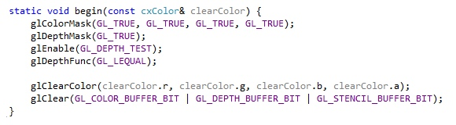

Мы тут разрешаем запись во все цветовые каналы (R, G, B, A) вызовом `glColorMask`. В общем-то все каналы включены в OpenGL по умолчанию, но мы можем использовать этот вызов чтобы временно отключить некоторые из них, что может быть полезно для визуальной разработки (напр. подстроить параметры освещения, когда оно будет. Как упоминалось выше, перекомпиляция для нас не проблема.

Далее мы включаем запись в *Z-buffer* вызовом `glDepthMask`, включаем Z-тест вызовом `glEnable` с соотв. параметром, и выбираем подходящую функцию для сравнения Z-значений при рисовании — `LEQUAL`, то есть Z-тест будут проходить те пиксели, расстояние от которых до камеры <= по сравнению с теми, что были записаны ранее (по умолчанию используется функция LESS, но <= несколько полезнее на практике.

Эти значения мы тут считаем глобальными для всей сцены, что пока нас устраивает. На деле ситуация несколько сложнее; скажем, если мы захотим сюда добавить 2D спрайты, то при их рисовании будет желательно выключать обновление Z-буфера и Z-тестирование. Но пока нас интересуют только 3D сцены.

Наконец, мы устанавливаем желаемый цвет для очистки экрана вызовом `glClearColor` и очищаем все рабочие буфера вызовом `glClear` (мы очищаем COLOR, DEPTH и STENCIL, последний мы не используем, но вреда от его очистки нет, скорее польза, так как этот буфер скорее всего присутствует как часть Z-буфера и вся операция будет выполнена быстрее когда его очистка включена.

Соответствующая `end()` функция уже написана в примере и состоит просто из вызова `OGLSys::swap`: мы используем double-buffering; swap меняет *screen* (что показывается) и *offscreen* (куда мы рисуем) буфера местами. Это можно считать точкой синхронизации, тут гарантируется, что все OpenGL команды рисования будут выполнены, и полученный в результате offscreen буфер будет показан на экране, синхронизируясь с частотой обновления монитора. На деле ситуация может быть более запутанной, в частности под macOS swap вызов ничего не делает и синхронизация происходит в другом месте.

Но лучше про всё это думать в терминах описанных выше и игнорировать системные особенности. Мы ещё вернёмся к этим begin/end функциям когда пройдём всё упражнение так как в них может выполняться заметно больше операций чем нам сейчас необходимо, и даже более того – за ними может стоять несколько иной механизм, но с точки зрения использующего кода протокол остаётся прежним — begin начинает кадр, end завершает.

## 3. OGL vtx shader
Следующим шагом у нас будет написание GPU программы, первым делом vertex shader, отвечающий за преобразование вершин модели.

Это одна из самых сложных частей упражнения, будем подходить к этому постепенно. Вторая составляющая GPU программы, pixel shader, наоборот у нас пока будет очень простая. «Pixel shader» также известен как «fragment shader» в OpenGL терминологии.

Мы тут нацеливаемся на самый базовый OpenGL уровень, самую первую версию GLSL. Мы в общем-то ничего от этого не теряем и приобретаем широкую совместимость.

Я по ходу объяснения упомяну некоторые отличия от более новых OGL/GLSL версий.

Vertex shader листинг:
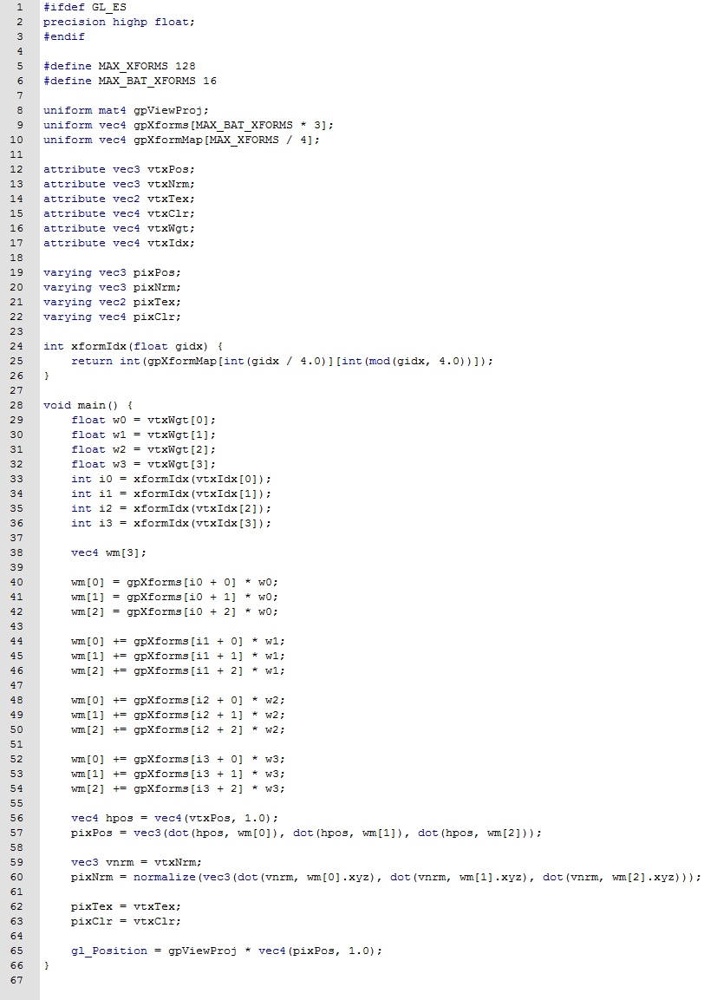

Текст обоих shader’ов будет находиться в data/ogl_x директории. Там уже помещены для них заготовки и пока наверное тут же их надо и редактировать, хотя при реальной разработке правильнее помещать такой GLSL код в src директорию и копировать в data как часть build процесса.

В этих заготовках пока только директивы препроцессора. В обоих случаях проверяется компилируется ли код для OGL ES и если да, то задаётся точность для float вычислений. На vertex уровне выбирается наивысшая точность, для pixel/fragment уровня средняя. Для ES это задание точности обязательно в pixel shader, в desktop OGL наоборот эти директивы могут не работать, поэтому и соответствующая `#ifdef` проверка.

Этот выбор точности это только подсказка для GLSL компилятора и OGL драйвера, на desktop выбор меньшей точности скорее всего просто ничего не делает, но на мобильных GPU mediump работает и даёт заметное ускорение.

Надо также иметь в виду, что для вычислений, которые производятся на vertex уровне для 3D графики, средней точности недостаточно.

Что именно означает mediump зависит от платформы, но на практике можно считать, что это 16-битное float представление.

В `vtx.vert` также уже определены пара констант, `MAX_XFORMS` и `MAX_BAT_XFORMS`, максимальное число трансформаций на отдельную модель и максимальное число трансформаций на отдельный batch такой модели, рассмотрим это в скором времени. Трансформации представлены в виде матриц, но несколько нетипичным образом, далее даётся объяснение этого представления и после этого мы сможем рассмотреть подробно листинг для vertex shader.

Припомним как мы представляем преобразования в пространстве в виде матричных операций. Ограничимся для начала вращениями.

Мы начинаем со стандартной системы координат:

Ось X представлена вектором `(1, 0, 0)`; Ось Y это вектор `(0, 1, 0)`; Ось Z — вектор `(0, 0, 1)`. Мы поворачиваем всю эту систему осей, согласно формулам, которые для нас сейчас не важны, и получаем три новых вектора осей.

Если мы примем соглашение, что вектора записываются в виде строк, `[x y z]`, то мы можем поместить эти новые координаты осей в 3-строчную матрицу:
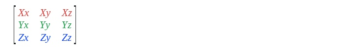
Красная строка это новые координаты оси X и т.д.

Пользуясь матричной алгеброй мы теперь можем перенести (трансформировать) произвольный вектор в эту новую систему координат так:
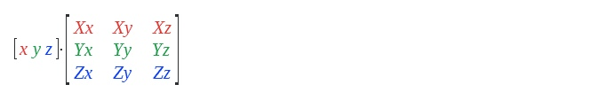
Мы в результате получаем трансформированный вектор с координатами `[x’ y’ z’]`, которые можно явно записать в таком виде:
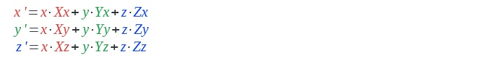
Из этих последних формул можно заметить, что каждая трансформированная координата это скалярное произведение начальных координат с соответствующей колонкой матрицы:
```
x’ = dot([x, y, z], col[0]) 
y’ = dot([x, y, z], col[1]) 
z’ = dot([x, y, z], col[2])
```
*Отсюда также можно представить геометрическую интерпретацию трансформации — новые координаты xyz’ это взвешенная сумма новых осей, где веса это начальные координаты [x y z].*

Мы будем это явное dot-product представление трансформации использовать в своём vertex shader по причинам, которые будут далее описаны.

Но сначала нам надо добавить возможность не только поворачивать, но и перемещать объекты. Визуально, после того, как мы повернули оси, мы можем перенести начало координат в произвольную позицию `Txyz`. Финальные координаты в этом случае мы можем посчитать прибавив `Txyz` к `xyz`’.

Но для удобства тут используют трюк, который позволяет представить и вращение и перемещение в виде одной матрицы.

Прежде всего, координаты смещения помещают в новую строку:
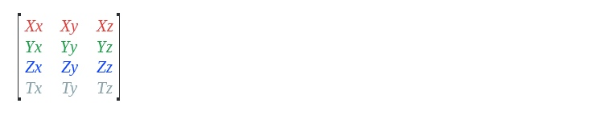
Это даёт матрицу 4x3 и мы теперь не можем умножить 3-элементный вектор на такую матрицу. (Напомню мнемонику умножения матриц::: MxN * NxP = MxP::; «внутренние» размеры должны быть равны, результат имеет «внешние» размеры. У нас 1x3 * 4x3, что нарушает это правило.) Трюк поэтому заключается в дополнении вектора четвёртым элементом со значением 1 (используя идею взвешенной суммы — единица это вес начала координат).

Координаты вектора теперь представляются как `[x y z 1]`.

Следующее наблюдение это то, что такой вектор это в действительности «точка» — точка это позиция в пространстве, а вектор имеет направление (и длину), но не имеет позиции.

Но если четвёртым элементом назначить 0, то это будет представлять трансформацию вектора (начало координат не влияет на результат), то есть такая форма позволяет представить и вектора и точки однородно.

Далее чтобы продвинуть эту однородность на шаг дальше, к матрице добавляют ещё одну колонку, которая делает явным, что первые три строки это вектора (оси), а четвёртая строка это точка (начало координат).

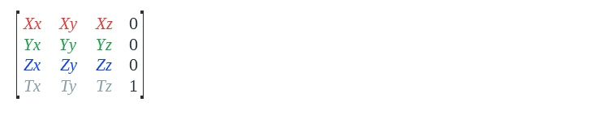

В результате формула трансформации для точки выглядит так:
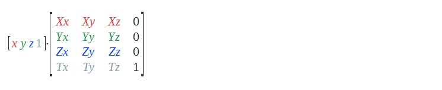

Для трансформации вектора последняя координата в векторе слева устанавливается в 0.

В компьютерной графике используют матрицы 4x4 и по причине удобства такого однородного представления, а также потому, что это позволяет представить проекционные трансформации, где последняя колонка уже не будет константной (а также потому, что с квадратными матрицами в целом проще работать). Но рассмотрим теперь ситуацию с которой нам придётся сейчас иметь дело при передаче трансформаций на GPU, в vertex-shader.

Мы тут, во-первых, столкнёмся с проблемой ограниченных ресурсов которые используются для этой передачи.

Во-вторых, эти ресурсы имеют гранулярность 4-элементного вектора.

Трансформаций может быть достаточно много, и использование последней константной колонки кажется (и – даже в относительно простых сценариях – является) расточительством.

По причине гранулярности нам также не подходит эта строчная форма матрицы (мы никак в этой форме не можем отбросить последнюю колонку, всё равно понадобится 4 4-элементных вектора на матрицу).

Поэтому матрицы трансформаций у нас будут иметь такой формат 3x4:
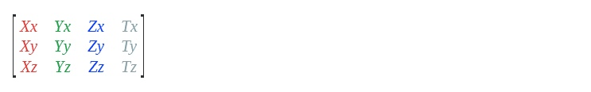
Назовём эту форму «оси в колонках» в противоположность тому, что мы использовали в самом начале.

Это ещё не вся история, так как помимо того, как хранятся оси, есть ещё различие по способу хранения матриц в памяти — сначала строки (row-major), то есть также как на письме, или сначала колонки (column-major).

OpenGL следует column-major соглашению и это надо иметь в виду.

В vertex-shader мы будет трансформировать координаты и вектора «вручную», используя последовательность dot-product операций.

Но для трансформации в экранное пространство мы будем использовать встроенный оператор умножения матриц в GLSL и нам надо будет учесть последовательность аргументов.

В целом, я полагаю что путаница с представлениями матриц это то место, где обучение графическому программированию заканчивается для большинства энтузиастов, а также причина почему многие считают это вообще невозможным без использования готовой системы. Поэтому тут и уделяется этому некоторое внимание. Мы можем так думать про передачу параметров на GPU — значения передаются через специальный банк регистров.

В GLSL программе эти параметры объявляются ключевым словом *uniform*.

Регистры эти векторные, состоят из 4-х элементов и это определяет гранулярность с которой регистры выделяются под uniform параметры.

Например, мы объявляем такие параметры:
```
uniform mat4 matrixParam; 
uniform float scalarParam; 
uniform vec3 xyzVec; 
uniform vec4 xyzwVec;
```

`mat4` это встроенный GLSL тип, матрица 4x4, и под `matrixParam` будет выделено 4 регистра. Под скалярное float значение `scalarParam` будет выделен целый векторный регистр, хотя оно помещается в одном элементе такого регистра.

`vec3` и `vec4` также встроенные GLSL типы, под `xyzVec` и `xyzwVec` тут будет выделено по регистру, хотя первый состоит только из трёх элементов.

Эта особенность порождает подход к описанию параметров, который избегает подобный расход отдельных элементов регистров, так как число этих регистров ограничено.

Например, если есть три `float` параметра `fogStart, fogEnd, fogDensity`, то имеет смысл не объявлять их отдельно как `uniform float`, а объявить один векторный параметр и поместить их в его элементы:
```
uniform vec4 fogParams;
```

и далее в GLSL коде извлечь их в соответствующие локальные переменные:
```
float fogStart = fogParams.x;
float fogEnd = fogParams.y;
float fogDensity = fogParams.z;
```

В новых версиях OpenGL есть некоторые способы автоматической упаковки значений, но это полностью не убирает этой особенности. Кроме того, эти новые конструкции скорее запутывают дело для начинающих (многих из тех, кто продолжает барахтаться в трясине представления матриц в памяти, утянут на дно правила хранения параметров).

Как было сказано, число этих регистров ограничено, конкретное ограничение зависит от версии OpenGL.

Мы нацеливаемся на самый базовый уровень, которым можно считать WebGL спецификацию, где для vertex shader можно использовать до 256-и регистров.

Посмотрим на нашу задачу передачи трансформаций в vertex shader.

Как ранее было описано, трансформации мы представляем в виде матриц 3x4, то есть каждая такая матрица занимает три регистра.

Каждая матрица представляет сустав в скелете модели, весь скелет передаётся в виде массива таких матриц, посмотрим сколько может быть суставов в таком скелете, учитывая вышеупомянутое ограничение на число регистров.

80 будет приемлемым выбором, это даёт нам `80*3=240` регистров для скелета, нам нужно ещё 4 регистра на объединённую трансформацию для вида камеры и проекции на экран, и ещё 12 регистров остаются в резерве на случай если нам в будущем понадобятся какие-то дополнительные параметры на vertex уровне.

Так можно было бы сделать, но 80 суставов это на деле не так уж много и в целом приемлемое, но неудобное ограничение.

Собственно в модели туристки, которая сейчас в сцене стоит перед камерой, как раз 80 суставов влияющих на деформацию, хотя я специально это не подбирал.

Максимум в 128 суставов будет гораздо более приемлемым, но это не поместится в наш бюджет из 256-и регистров.

Мы поэтому будем использовать более хитроумную схему, которая будет описана далее.
Ранее упоминалось, что модели для рисования разбиваются на части, называемые *batches*. Это разбиение может делаться при экспорте, при загрузке или даже «на лету» при рисовании модели.

В нашем случае модели уже поделены нужным образом при экспорте.

Но по какому принципу производится такое разбиение?

Очевидно, что если к модели применены несколько текстур, то понадобится разбиение «по текстурам». Более общее определение это разбиение «по материалам», так как даже если на разные части модели назначена одна текстура, другие параметры могут отличаться (в одной части модели взять 90% цвета из текстуры, в другой 75% и т.д.).

Модели, которые имеют большой размер в пространстве может быть желательно разбить на группы по принципу пространственной локальности.

Что нам важно для текущего обсуждения это разбиение по количеству трансформаций. Не все суставы скелета влияют на все точки модели, скажем, в модели персонажа суставы правой руки не влияют на точки левой.

Соответственно модели наши уже разбиты на отдельные batch группы таким образом, чтобы в каждой группе было не больше 16-ти суставов и это позволяет нам уложиться в ограниченный бюджет регистров.

В vertex у нас это определено константой
```
#define MAX_BAT_XFORMS 16
```

и объявлен блок регистров для передачи такого набора 3x4 матриц
```
uniform vec4 gpXforms[MAX_BAT_XFORMS * 3];
```

(т.е. на каждую трансформацию отводится по три 4-элементных регистра).

(В новых GLSL версиях есть матричный тип, соответствующий нашему формату трансформаций, но, как говорилось, по причине типичной OGL путаницы я предпочитаю более прозрачное представление, а начинающим тем более советовал бы использовать только самые базовые конструкции.)

Будем использовать `gp*`префикс для всех подобных интерфейсных объявлений, это означает «Global Parameter» (или, по желанию, «GPU Parameter»).

Теперь следует упомянуть, что номера трансформаций хранятся в атрибутах каждой вершины (мы вскоре подробнее рассмотрим формат хранения вершин.)

На каждую вершину может влиять до четырёх трансформаций.

Эти номера могут представлять из себя «глобальный индекс», то есть номер сустава во всём скелете или «локальный индекс», относительный номер сустава в отдельной batch группе. Скажем у нас есть суставы левой руки, с такими глобальными индексами:
```
11: Shoulder_L 
12: Elbow_L
```

Если номера суставов хранятся в глобальном формате, то для точек в районе локтя в атрибутах будут храниться эти индексы 11 и 12.

Если же эти точки относятся к группе на которую влияют только эти два сустава и номера суставов хранятся в локальном формате, то в атрибутах будут уже относительные индексы 0 для Shoulder и 1 для Elbow. Если бы мы хранили номера суставов в локальном формате, то вышеобъявленный gpXform массив это всё, что нам было бы нужно.

Но у такого подхода есть один недостаток.

Посмотрим на более длинный набор суставов:
```
10: Clavicle_L 
11: Shoulder_L 
12: Elbow_L 
13: Wrist_L
```

При делении модели, предположим, мы получили группу на которую влияют 10, 11, 12 и другую группу, на которую влияют 11, 12 и 13. Предположим также, что последний полигон первой группы и первый полигон второй имеют общую вершину, на которую влияют Shoulder и Elbow, локальные индексы этих суставов зависят от группы, в первой группе это будет 1 и 2, во второй 0, 1. Поэтому в локальном формате это будет уже не одна вершина, а две, хотя все остальные атрибуты (нормаль, цвет, текстура) в этой точке одинаковые.

Другими словами, такой подход с локальными индексами требует создания дубликатов для некоторых вершин. Это вполне приемлемо, но мы пойдём другим путём.

Мы сохраним глобальные индексы в атрибутах вершин, но будем передавать в vertex shader таблицу для трансляции глобальных индексов в локальные, которые в свою очередь будут уже использоваться для индексирования в массиве трансформаций.

На листинге эта таблица объявлена как `gpXformMap` и мы далее рассмотрим подробнее как работает эта схема трансляции индексов, а также vertex shader в целом.

Вернёмся к нашему примеру с batch группой, на которую влияет пара суставов с глобальными индексами 11 и 12, эти глобальные индексы отображаются на локальные индексы 0 и 1: 
```
global(11): Shoulder_L -> local(0) 
global(12): Elbow_L -> local(1) 
```
В атрибутах вершин хранятся значения 11 и 12, в vertex shader мы используем специальный массив, назовём его `map[]`, который транслирует глобальные индексы в локальные.

Массив этот заполняется на стороне CPU перед тем как вызывается наша GPU программа.

В нашем примере он будет выглядеть так:

`map[11] = 0 map[12] = 1` В остальных ячейках произвольные значения.

Размер этого массива равен максимальному числу суставов на модель, мы приняли тут значение 128 (константа `MAX_XFORMS` в коде).

Мы получаем локальный индекс из глобального так:

`idxLocal = map[idxGlobal]`

Просто, но тут надо принять во внимание некоторые особенности GLSL.

Не углубляясь в разницу между версиями, скажем, что естественный тип для GPU программ это float поэтому и тип значений этого map массива будет не int, а float.

Далее надо учесть упоминавшуюся гранулярность с который выделяются регистры.

Мы не можем объявить этот массив как float map[128] так как это выделит 128 vec4 регистров, тогда как для нашей таблицы достаточно в 4 раза меньше.

Поэтому мы объявляем таблицу так:

```
vec4 map[MAX_XFORMS / 4]
```
И трансляция индекса будет выглядеть так:

```
idxLocal = map[idxGlobal / 4][idxGlobal % 4] 
```
где % это операция получения остатка от деления, и деление подразумевается целочисленное. То есть нужный вектор находится по индексу `(idxGlobal / 4)`, а нужный элемент по индексу `(idxGlobal % 4)` в этом векторе.

GLSL позволяет обращаться к элементам вектора как по именам `(v.x, v.y и т.д)`, так и по индексам.

Полный код показван на листинге в начале.

Массив тут называется `gpXformMap` и функция `xformIdx` производит вышеописанную трансляцию, остаток от деления в GLSL выполняется функцией `mod`.

Последняя деталь, которая до этого не упоминалась — трансформации у нас хранятся как массив примитивных векторов `vec4`, это означает, что каждая отдельная матрица 3x4 начинается по индексу `idxLocal*3` в `gpXforms`. То есть после трансляции мы должны ещё умножить индекс на 3. Но это умножение на константу можно сделать заранее, на CPU-стороне, то есть все значения в map[] уже будут умножены на 3 при заполнении таблицы. Типичная оптимизация для подобного рода кода.

Перед разбором полного кода vertex shader, полезно посмотреть на то, как представлены данные о вершинах модели.

В листинге после `uniform` объявлений идёт блок переменных начинающихся с ключевого слова `attribute`:

```
attribute vec3 vtxPos;
attribute vec3 vtxNrm; 
```
и т.д.

Данные о каждой вершине состоят из этих атрибутов: положения в пространстве (Pos), вектора нормали к поверхности в этой точке (Nrm), текстурных координат (Tex), цвета (Clr), веса суставов, влияющих на эту вершину (Wgt) и (глобальных) индексов этих суставов (Idx). Деформация ограничена четырьмя весами на точку, что на практике большим ограничением не является.

Эти данные при инициализации записываются в специальную память, доступную GPU, которая называется *Vertex Bufer*.

Следующая иллюстрация показывает как эта структура выглядит в CPU и GPU коде:
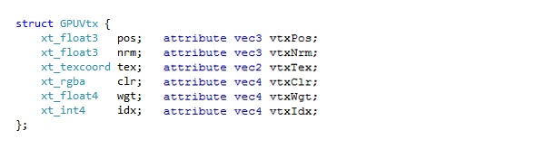

Vertex Bufer это массив таких структур.

Структура `GPUVtx` уже определена в `draw_ogl_x.cpp`.

`xt_*` типы, используемые в описании GPUVtx структуры, это примитивные crosscore типы, которые предназначены прежде всего именно для такого использования — описание GPU данных в CPU коде.

Тут можно обратить внимание, что тип поля idx на CPU объявлен как целочисленный вектор xt_int4, но в GPU shader поступает уже в виде vec4, то есть floatng-point вектора.

Как упоминалось, для GPU натуральным типом данных является float. Данные в GPU памяти могут храниться в различных форматах, но в GPU программу они поступают в виде float. Мы можем считать, что есть транслирующий слой, который эффективно производит необходимые преобразования «за кулисами».

В этом конкретном случае мы ничего особенно не выигрываем от использования int4 в памяти, тут это больше в целях демонстрации этой особенности. Но в реальной ситуации имеет смысл закодировать данные вершин в как можно более компактном виде и тут становится полезной эта поддержка разных представлений в памяти. Но это сложная тема, мы пока углубляться в неё не будем. Продолжим разбрирать наш vertex shader.

Помимо вспомогательной функции для трансляции индексов деформации тут есть только точка входа main(), где вроде бы довольно много кода, но эта многословность прежде всего потому, что мы используем самые низкоуровневые конструкции.

Первые операторы тут копируют индексы трансформаций и их веса в локальные переменные. На положение точки оказывают влияние трансформации с индексами i0, i1, i2 и i3, их влияние определяется соответствующими весовыми коэффициентами w0, w1, w2 и w3.

Веса имеют значения от 0 до 1, сумма всех четырёх весов должна быть равна 1 (т.е. 100%).

Если на вершину оказывает влияние меньше четырёх трансформаций, то лишние веса устанавливаются в 0.

Матрица трансформации для вершины это взвешенная сумма этих четырёх матриц: 
```
wm = xforms[i0]*w0 + xforms[i1]*w1 + xforms[i2]*w2 + xforms[i3]*w3
```

Последовательность операций в строках 40-54 в листинге именно это и считает.

Полученная матрица wm трансформирует точку в мировое пространство.

Теперь самое время прояснить один момент, ранее не упоминавшийся.

Можно выделить три типа объектов в сцене:

STATIC — трансформация отсутствует, точки модели уже в мировом пространстве. Пример этого типа это модель сцены, Костина улица в нашем упражнении.

RIGID — модель перемещается целиком, без деформаций. Это могут быть например какие-то бочки, расставленные по сцене, модель одна, её экземпляры помещены в сцену с разными трансформациями.

SKIN — модель деформируется органическим, гибким образом. Это персонажи, деревья и прочее.

Можно заметить, что для STATIC матрица трансформации не нужна вообще, для RIGID нужна одна трансформация, и для SKIN нужен взвешенный набор трансформаций (до четырёх на вершину, до 128-и на модель, по принятым нами ограничениям).

Мы до сих пор вроде бы обсуждаем только один тип, SKIN, но что насчёт остальных двух? Дело в том, что SKIN включает в себя остальные типы.

Для STATIC моделей мы устанавливаем все индексы трансформаций в атрибутах точек в 0, вес w0 мы устанавливаем в 1, остальные веса в 0. Трансформацию в gpXforms по индексу 0 мы устанавливаем в идентичность, то есть трансформацию, которая ничего не меняет. В результате все вершины модели будут проходить через наш vertex shader без изменений.

Для RIGID мы поступаем так же как описано выше, но в gpXforms по индексу 0 помешаем не идентичность, а желаемую трансформацию.

Мы увидим это подробнее, когда будем разрабатывать соответствующие C++ функции.

Тут может возникнуть вопрос по поводу того, что для STATIC и RIGID моделей мы расходуем и память (в Vertex Bufer) и вычислительные ресурсы (в vertex shader). Действительно, но это цена, которую мы платим за упрощение и CPU и GPU кода. В целом это умеренно приемлемый подход даже для реальных применений, если цели в смысле сложности сцен не очень высокие. В любом случае, если принципы освоены, то оптимизировать эту часть уже несложно.

Можно также заметить, что эта деталь полностью спрятана за Draw интерфейсом, и, действительно, полноценная реализация в draw_ogl.cpp использует более оптимальный подход.

В vertex shader у нас пока остался нерассмотренным блок переменных, объявление которых начинается с ключевого слова varying и имена с префикса pix.

Напомню последовательность графических операций:

`[Vertex shader] -> [Rasterizer] -> [Pixel shader]` Vertex & Pixel этапы программируемые, Rasterizer фиксированный.

Vertex shader в результате своей работы производит нормализованные (независящие от конкретного разрешения) экранные координаты и набор произвольных значений для передачи в pixel shader.

Экранные координаты записываются в специальную переменную с именем gl_Positon, а значения для pixel shader в переменные объявленные как varying.

Rasterizer использует gl_Positon значения, произведенные на vertex уровне, для генерации точек на экране, интерполирует varying значения и вызывает pixel shader для каждой точки. "Программа" в OpenGL это комбинация vertex и pixel этапов.

Uniform значения представляют интерфейс программы в целом, то есть они общие для vertex и pixel этапов, хотя тут надо иметь в виду некоторые тонкости.

Uniform остаются неизменными во время выполнения программы, varying значения меняются.

Теперь мы можем посмотреть на код в vertex shader, который следует за получением матрицы трансформации wm.

Начиная со строки 56 в листинге:

Преобразуем позицию вершины в однородное представление, из 3-мерного вектора в 4мерный, добавляя единицу.
```
vec4 hpos = vec4(vtxPos, 1.0);
```

Вычисляем трансформированные координаты и записываем значение в выходную переменную pixPos, в соответствии с описанием выше (см. также Приложение в конце этой части):
```
pixPos = vec3(dot(hpos, wm[0]), dot(hpos, wm[1]), dot(hpos, wm[2]));
```

Вычисляем трансформированную ориентацию нормали, это делается тем же способом, что и вычисление позиции, но 3-мерный вектор дополняется не единицей, а нулём; мы тут не делаем это дополнения явно, а используем только три первых компонента из строк матрицы:

```
vec3 vnrm = vtxNrm; pixNrm = normalize(vec3(dot(vnrm, wm[0].xyz), dot(vnrm, wm[1].xyz), dot(vnrm, wm[2].xyz)));
```

Координаты текстур и значения цвета мы передаём без изменений:
```
pixTex = vtxTex; 
pixClr = vtxClr;
```

Наконец, вычисляем координаты относительно положения камеры и делаем их проекцию в нормализованное экранное пространство.

Это делается одной комбинированной матрицей трансформации, которая применяется к трансформированной позиции, посчитанной выше. Тут есть определённая неприглядная деталь, связанная с формой представления матриц в OpenGL, пока игнорируем, просто принимаем, что это даёт желаемый результат:
```
gl_Position = gpViewProj * vec4(pixPos, 1.0);
```

Следующим шагом мы рассмотрим вторую составляющую GPU программы, pixel shader, и затем уже перейдём к C++ функции, выполняющей загрузку и инициализацию этого GLSL кода.

**Приложение.**

Команды Maxima для умножения строчного вектора на 4x4 матрицу трансформаций, где оси находятся в строках матрицы:
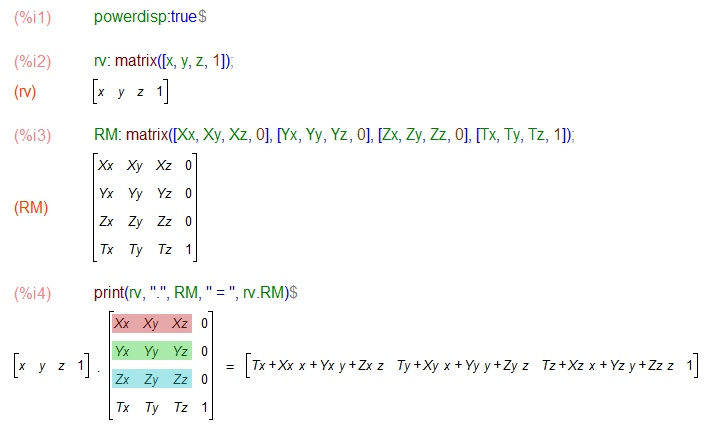

Соответствующее умножение для нашего формата преобразований 3x4, тут оси уже находятся в столбцах матрицы, вектор тоже представлен в виде столбца и в умножении находится справа от матрицы, обоих случаях вектор дополнен единицей в четвёртом элементе:
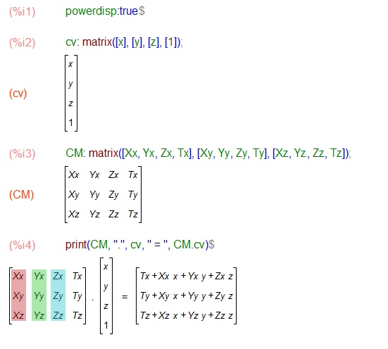

Формулы для обоих преобразований помещённые рядом, чтобы легче было увидеть, что (x, y, z) результатов одинаковые, просто в первом случае получается строковый вектор, во втором столбцовый:
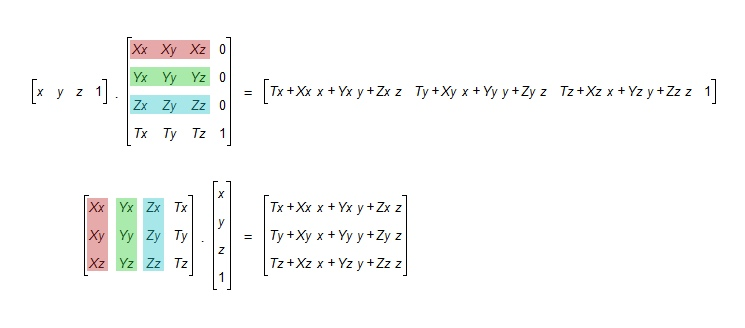

Тут показано, что означают переменные в vertex shader коде и как мы тут производим вычисления, используя встроенную dot функцию в GLSL:
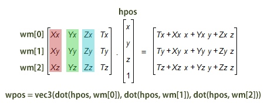

## 4. OGL pixel shader
Pixel shader показан на следующем листинге и наверное сразу можно заметить, что он крайне простой:
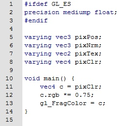
Мы тут получаем интерполированное значение цвета, берём 3/4 от его RGB каналов и записываем результат в ещё одну специальную переменную с именем gl_FragColor, выходное значение для pixel shader.

Для всех моделей в этом примере в вершинах было запечено амбиентное освещение, поэтому, используя эти цветовые значения, мы можем получить относительно разборчивую картинку даже без использования текстур и освещения.

Умножение цвета на 3/4 тут делается чтобы изображение не было слишком ярким, так как эти цвета в вершинах рассчитаны на использование вместе с текстурами, которые мы сейчас игнорируем.

Тут можно заметить, что объявлены все те же varying переменные, которые присутствовали на vertex уровне, хотя используется только pixClr. Лишние переменные можно было не объявлять, но вреда от этих объявлений нет и в таком виде этот shader уже готов для дальнейших экспериментов, выходящих за рамки этого первого упражнения.

## 5. OGL init_gpu_prog()
Теперь наша задача в `draw_ogl_x.cpp` написать подпрограмму `init_gpu_prog()`, которая вызывается из интерфейсной функции init.

Листинг:
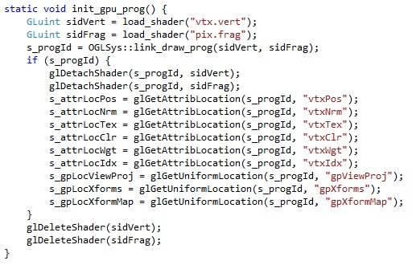

Первым делом нам тут надо загрузить файлы с GLSL кодом, для чего мы воспользуемся вспомогательной функцией load_shader:

```
GLuint sidVert = load_shader("vtx.vert");
GLuint sidFrag = load_shader("pix.frag"); 
```

В результате мы получаем пару shader идентификаторов для скомпилированного shader кода, что точно тут означает компиляция не определено, это может быть просто предварительный разбор, но вполне можно думать про полученный результат как про объектный модуль для Си кода.

Если load_shader возвращает 0, то произошла ошибка, информация о которой будет выведена на консоль. Надо иметь в виду, что текст ошибок, выдаваемый встроенным компилятором OpenGL драйвера, часто неудобочитаемый. Поэтому в реальной ситуации имеет смысл выполнять offline компиляцию пользуясь специальными утилитами. В нашем случае обойдёмся без этого, в случае ошибки можно будет свериться с листингами.

Теперь мы должны получить работающую программу, выполнив link операцию с двумя скомпилированными shader объектами:
```
s_progId = OGLSys::link_draw_prog(sidVert, sidFrag); 
```

Мы тут используем имеющуюся функцию из OGLSys, избегая некоторой рутины, связанной с этими операциями.

Результат мы сохраняем в статическую переменную, так как это значение должно быть доступно для других функций во время работы этого модуля.

Тут тоже нулевое значение для progId будет означать ошибку (объекты и программы представляются беззнаковым типом GLuint), информация о которой будет выведена на консоль. Ошибки link этапа сложнее проверить offline, но обычно они более очевидные и текст, выдаваемый встроенным компилятором более точный.

Если link операция удалась, то мы инициализируем интерфейс GPU программы внутри блока 
```
if (s_progId) { ...

}
```

Первым делом мы выполняем Detach операции для скомпилированных shader объектов, перед link операцией объекты присоединяются (Attach) к программе, когда операция выполнена их можно отсоединить и удалить.

```
glDetachShader(s_progId, sidVert);
glDetachShader(s_progId, sidFrag); 
```

Это можно было сделать внутри `OGLSys::link_draw_prog`, но по определённым причинам я при разработке этой вспомогательной функции решил оставлять их соединёнными, поэтому мы выполняем это тут. В тонкости этого процесса компиляции мы пока углубляться не будем, тема для отдельных бесед.

Теперь нам надо получить численные идентификаторы для всех входных значений, которые мы объявили в GLSL коде (в нашем случае все они объявлены в vertex shader).

Сначала для attribute значений, описывающих формат вершин:

```
s_attrLocPos = glGetAttribLocation(s_progId, "vtxPos");
...
```

затем для uniform, содержащих параметры GPU программы.

```
s_gpLocViewProj = glGetUniformLocation(s_progId, "gpViewProj");
...
```

Эти значения тоже будут нужны на протяжении работы всего модуля и сохраняются в статических переменных.
Их тип GLint, то есть знаковый, и ошибочное значение тут представляется как f1.

Наконец, мы удаляем shader объекты вызовами `glDeleteShader`, в нашем простом сценарии они больше не понадобятся.

## OGL ifunc reset
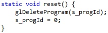
Интерфейсная функция reset, показанная на листинге выше, крайне простая, пара строк.

Мы удаляем GPU программу вызовом glDeleteProgram и обнуляем соответствующую статическую переменную.

Но тут надо прежде всего обратить внимание на место этой функции в жизненном цикле всей системы — это вызывается либо при завершении программы, либо при необходимости реинициализации, например если нужно сменить разрешение.

Тут надо освободить все глобальные графические ресурсы (programs, render targets etc.) и привести весь модуль в девственное состояние. Последнюю задачу мы тут выполняем пожалуй не полностью, надо было бы ещё сбросить все значения s_atrroc* и s_gproc* в -1.

В полноценной системе было бы также хорошо вести учёт всех выделяемых графических ресурсов и освобождать их при вызове reset (так было например сделано во Phlox). В этом примере это в общем-то сейчас делается уровнем выше, как часть модуля управления сценой, но в надёжной системе не помешает продублировать и на этом уровне для низкоуровневых ресурсов, на случай если что-то пойдёт не так в других модулях.

## OGL sub prepare model
Следующая по сценарию функция производит инициализацию GPU-представления модели. 
Листинг:
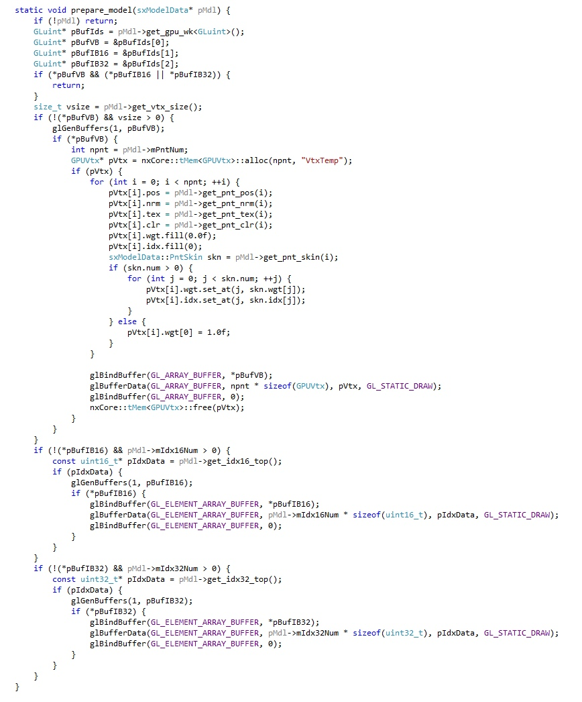

Первое замечание, которое можно сделать о функции prepare_model это то, что она не часть Draw интерфейса.

Тем не менее, она всё же доступна извне нашего модуля, но косвенным образом.

В интерфейсной функции init вызываются две подпрограммы инициализации — init_rsrc_mgr, которая была написана заранее в заготовке и init_gpu_prog, которую мы написали на предпоследнем шаге.

Теперь самое время посмотреть мельком на init_rsrc_mgr — тут для менеджера ресурсов устанавливается интерфейса для создания и освобождения моделей и текстур, что и даёт вышеупомянутый косвенный способ вызова prepare_model функции.

prepare_model может вызываться в двух случаях:

1) код верхнего уровня инициализирует GPU представление модели заранее, например после загрузки данных этой модели;

2) модель рисуется первый раз и специализируется "ленивым" образом внутри нашей Draw реализации; В первом случае эта функция будет вызываться упомянутым косвенным способом.

Во втором мы будем вызывать её прямо, в интерфейсной функции рисования batch(). Одно из требований к этой функции это поддержка повторных вызовов, то есть если GPU ресурсы уже были выделены, но функция ничего больше не делает, если ещё нет (или были освобождены), то выполняются необходимые OpenGL операции.

GPU ресурсы, представляющие модель, это Vertex Bufer (VB), который уже упоминался, и один или два Index буфера (IB), которые описывают как вершины соединены в треугольники, то есть, в соответствии с названием, содержат индексы вершин из VB.

IB может быть два, так как, хотя модели обычно содержат только 16-битные индексы, в некоторых случаях модель может быть достаточно большой чтобы потребовать 32-битного представления. 32-битные индексы это нестандартная возможность на уровне ES2/WebGL, но такие большие модели прежде всего могут быть полезны на этапе разработки, поэтому имеет смысл их поддерживать для таких случаев.

Мы могли бы тут проигнорировать 32-битные индексы, но сделаем их поддержку для полноты.

Аргумент этой функции это указатель на данные модели, sxModelData, sx префикс в crosscore используется для Си++ структур.

Итак, как было сказано выше, эта функция будет вызываться постоянно при рисовании batch частей модели и первым делом мы должны тут проверить не выделены ли уже GPU ресурсы. Чтобы облегчить воплощение подобного сценария, sxModelData содержит в себе зарезервированную область памяти, предназначенную для хранения соответствующего состояния. Если бы этого не было сделано, то нам бы тут понадобился какой-то механизм отображения sxModelData* на соответствующие записи, содержащие информацию о выделенных GPU ресурсах.

Эта встроенная память имеет размер 32 байта, необходимые нам ресурсы это VB и один или два IB. В OpenGL все эти буфера представляются в виде беззнаковых целочисленных идентификаторов, на которые достаточно 12-и байт. В других API ресурсы могут представляться указателями, что на 64-битной платформе потребует 24 байта, но и на это места тут достаточно. (В некоторых низкоуровневых API для подобный ресурс может быть представлен двумя указателями — буфер и память, которая стоит за этим буфером, это потребует шести указателей,

48-и байт на 64-битной платформе; в таком случае надо будет вести внешний список или отказаться от поддержки 32-битных индексов.)

Удостоверившись, что нам действительно переданы данные модели (if (!pMdl) ...), мы запрашиваем эту рабочую память, как указатель на GLuint, тип необходимых нам идентификаторов OpenGL ресурсов:

```
GLuint* pBufIds = pMdl->get_gpu_wk<GLuint>(); 
```

далее устанавливаем указатели на идентификаторы VB, 16-битного IB и 32-битного IB.

То, что эти идентификаторы хранятся но индексам `[0], [1], [2]` в рабочей памяти, это просто внутреннее соглашение, вне нашего модуля содержимое рабочей памяти не определенно. Дальше мы выполняем проверку содержимого этих указателей, если VB и хотя бы один из IB уже созданы (ненулевые), то просто выходим.

Тут следует сказать несколько слов по поводу представления вершин модели в `sxModelData`. Для данных геометрии важно компактное представление и этот crosscore формат именно в таком представлении эти данные и содержит. В большинстве случаев предполагается, что данные эти сразу будут переданы на GPU в таком "упакованном" виде или перекодированы в ещё более оптимальное представление. Но использование такого представления заметно усложнило бы vertex shader, поэтому мы в этом упражнении идём в обратном направлении запрашиваем "сырое" представление данных вершин.

Чтобы облегчить подобное использование, методы `sxModelData::get_pnt_*`, которые видны на листинге, возвращают атрибуты модели в сыром виде и мы это используем в цикле чтобы заполнить временную память данными вершин.

Обращу внимание, что эта временная память выделяется через crosscore функцию:
```
GPUVtx* pVtx = nxCore::tMem<GPUVtx>::alloc(npnt, "VtxTemp"); 
```
(`nx` префикс означает namespace).

"VtxTemp" это имя выделяемого блока, в crosscore ведётся учёт всей выделяемой памяти вместе с этими именами, так, чтобы можно было посмотреть список выделенных блоков и получить имя по указателю (в будущем добавлю возможность перечислить все блоки с заданным именем).

Это единственное место в этом упражнении, где нам нужно выделять память, но полезно иметь в виду для будущих усовершенствований.

Перед созданием и заполнением VB, мы запрашиваем 
```
size_t vsize = pMdl->get_vtx_size(); 
```
это размер данных для одной вершины в компактном представлении, эти данные в файле модели могут иметь разные размеры, в зависимости от того, взвешенная модель или нет, а также какой формат используется для представления отдельных атрибутов.

Нам эта информация собственно не нужна, так как мы будем перекодировать данные в упрощённый формат, но проверка (`vsize > 0`), которая идёт далее, может считаться дополнительным тестом правильности данных, кроме того, в таком виде этот код может служить шаблоном для дальнейших усовершенствований, когда будет использоваться компактный формат.

Создание и заполнение VB делается только если он ещё не создан — проверка `!(*pBufVB)`. 
```
glGenBufers(1, pBufVB); 
```
Это выделяет идентификатор для VB.

Если полученный идентификатор ненулевой, выделяем временную память, как упоминалось выше.

Затем в цикле заполняем эту память, используя упомянутые `get_pnt_* `методы для получения сырых данных.

Мы используем информацию, возвращаемую `get_pnt_skin`, чтобы получить общее представление для всех типов моделей, независимо от того взвешена модель или нет (смотри ранее дискуссию о STATIC, RIGID, SKIN).

Копирование данных в GPU память производится OGL функцией `glBuferData`.

Замечу, что это именно копирование, так как в конце-концов память для хранения GPU данных должна находится по определённым физическим адресам или данные в неё должны быть пересланы по DMA и т.д., то есть эта операция требует низкоуровневых операций, более уместных для графического драйвера.

Типичная OpenGL последовательность сохраняет состояние между вызовами, так и в этом случае:

Мы выбираем тип буфера, в который мы хотим передать данные, и идентификатор конкретного буфера:

```
glBindBufer(GL_ARRAY_BUFFER, ...); 
```
Не очень удачное название GL_ARRAY_BUFFER означает VB.

Передаём данные:

```
glBuferData(GL_ARRAY_BUFFER, ..., GL_STATIC_DRAW); 
```
и сбрасываем состояние:

```
glBindBufer(GL_ARRAY_BUFFER, 0); 
```
Последняя операция не необходима, но лучше, для надёжности, в подобных случаях  нужно всегда сбрасывать выбранный буфер в нулевой.

Следует обратить внимание на `GL_STATIC_DRAW` значение в вызове `glBuferData`. Это означает, что данные будут записаны в GPU память один раз и меняться больше не будут. Следовательно, доступ к этим данным на GPU будет насколько возможно быстрым. Можно сказать, что модели и текстуры должны по большей части относится к этой статической категории. Это не всегда возможно, но если много графических данных такого типа требуют обновлений со стороны CPU, то возможно стоит пересмотреть дизайн системы.

Наконец мы освобождаем временную память.

Далее идёт код для копирования данных 16- и 32-битных индексов. Эти блоки проще, так как мы копируем эти данные из модели как есть, тут нет надобности в перекодировании. Последовательность OGL вызовов такая же, но тип буфера тут `GL_ELEMENT_ARRAY_BUFFER`, опять таки не самое удачное название, означающее IB.

## OGL sub release model
На листинге показана функция для освобождения ресурсов модели:
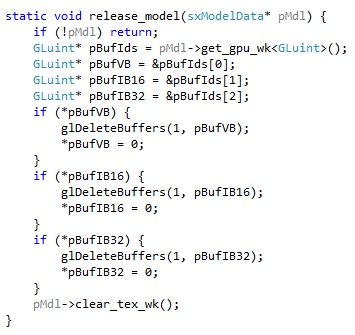

Как и её пара, `prepare_model`, это не часть Draw интерфейса, а доступна косвенно через интерфейс менеджера ресурсов (устанавливается в `init_rsrc_mgr`). Однако в этом случае это также единственный способ для её вызова, внутри нашего модуля эта функция нигде прямо не используется.

Эта функция теперь должна быть сразу понятна, получаем указатель на рабочую память модели, указатели на соответствующие VB и IB идентификаторы в этой памяти, удаляем буфера вызовами `glDeleteBufers`.

Последний оператор `pMdl->clear_tex_wk();` пока можем оставить без объяснений. Вкратце, это нужно для очистки привязки материалов к идентификаторам текстур. Мы текстуры в этом упражнении не используем, но этот вызов пусть будет для последующих расширений.

## OGL func batch
Последняя стадия этого упражнения, интерфейсная функция для рисования отдельной batch группы модели.
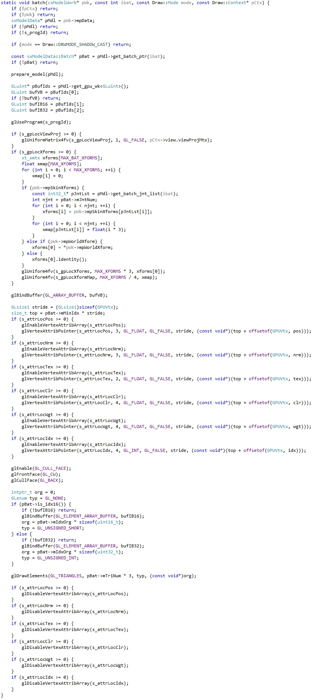

Тут набор аргументов сложнее чем у функций, которые мы рассматривали до этого, посмотрим на эти аргументы подробнее:

```
void batch(cxModelWork* pWk, const int ibat, const Draw::Mode mode, const Draw::Context* pCtx);
```

Мы говорили ранее, что есть различие между неизменными данными, описывающими геометрию, атрибуты и материалы модели, и отдельным экземпляром модели, помещённым в сцену.

Рассмотрим пример с какими-то типичными объектами, скажем бочками, расставленными по сцене.

Есть данные модели бочки, которые экспортируются из программы моделирования и загружаются в память нашей программы, эти данные представляются структурой `sxModelData`, с которой мы уже встречались.

В то же время, есть отдельные экземпляры этой бочки, которые помещены в разные места сцены, то есть, к ним применены разные трансформации. Рабочая память для таких экземпляров в crosscore представлена классом `cxModelWork`.

Первый аргумент batch функции имеет именно этот тип, и думать про это значение можно как про "состояние экземпляра модели".

(К слову, у нас в сцене сейчас нет бочек, которые бы были туда помещены подобным образом. Те, что есть, статически экспортированы как часть фоновой сцены. Если будем из этого делать публикуемый учебник, то наверное стоит разместить несколько бочек или чего-то подобного как отдельные объекты. Собственно, из текстовой сцены сейчас может быть неочевидна необходимость деления на Data и Work, так как все модели тут в единственном экземпляре. Но на деле экземпляры одной модели с разными параметрами практически всегда необходимы или желательны. Более того, это разделение в конце-концов ведёт к более понятному коду на системном уровне.)

Рабочее представление экземпляра модели, cxModelWork, уже содержит указатель на данные модели, `sxModelData`, которые нам тут понадобятся, поэтому отдельно указатель на данные не передаётся.

```
sxModelData* pMdl = pWk->mpData;
```

`int ibat` - это индекс batch группы модели, которую надо нарисовать.

Мы далее получаем указатель на описание batch группы таким образом:
```
const sxModelData::Batch* pBat = pMdl->get_batch_ptr(ibat); 
```

это вернёт `nullptr` если в `ibat` неправильное значение, в таком случае просто выходим из функции.

`Draw::Mode mode` — этот режим задаёт рисовать ли тени, отбрасываемые моделью или её нормальное изображение, а также как интерпретировать прозрачность.

Тени мы тут не поддерживаем, поэтому сразу выходим если был запрошен режим теней: 
```
if (mode == Draw::DRWMODE_SHADOW_CAST) return; 
```
Прозрачность мы тоже пока не поддерживаем, поэтому далее просто игнорируем разницу, задаваемую mode значением.

Наконец, 
```
Draw::Context* pCtx 
```
Тут есть некоторые тонкости, но удобное описание тут сейчас это "глобальный контекст сцены", скажем, освещение относится ко всем моделям сцены, также как и параметры камеры, поэтому передаётся в этой отдельной структуре.

В начале функции, проверив все передаваемые значения, запрошенный режим рисования, и получив указатель на описание batch группы, мы первым делом вызываем функцию инициализацию GPU представления модели, которую мы недавно разработали:
```
prepare_model(pMdl); 
```

То есть, тут происходит та самая "ленивая" инициализация о которой упоминалось ранее — если GPU представление не было создано заранее, то оно будет создано при первом отображении модели.

Далее мы используем уже знакомый метод `pMdl->get_gpu_wk<GLuint>()` для получения памяти, где хранятся идентификаторы GPU ресурсов: `VB, IB16, IB32`.

Активируем в OpenGL нашу ранее загруженную, скомпилированную и связанную GPU программу:
```
glUseProgram(s_progId); 
```
(Тут можно заметить, что и программу эту можно было бы инициализировать "лениво", при первом рисовании. Но так как она у нас одна, то в этом особого смысла нет. В реальной ситуации программ может быть много и это уже становится решением, которое заслуживает рассмотрения.)

Далее мы устанавливаем значения глобальных параметров, те самых uniform переменных, которые мы объявляли в нашем GLSL коде.

При инициализации GPU мы получили привязку этих интерфейсных переменных к конкретным регистрам, это значения статических переменных `s_gpLoc*`.

Первым делом устанавливаем значение комбинированной (`View * Projecton`) матрицы. Значение этой матрицы передаётся в структуре контекста (так как "камера" общая для всех моделей в сцене).

Значения в uniform регистрах устанавливается OpenGL функциями `glUniform*`, где * заменяется на различные типы данных. Нам в этом упражнении понадобится только пара эти функций, для матриц и векторов.

`ViewProjecton` это матрица 4x4 и соответствующий вызов это `glUniformMatrix4fv`.

Перед вызовом мы проверяем действительно ли эта uniform переменная была привязана к какому-то набору регистров в GPU программе, то есть `s_gpLocViewProj` содержит неотрицательное значение (>=0).

```
if (s_gpLocViewProj >= 0) { glUniformMatrix4fv(s_gpLocViewProj, 1, GL_FALSE, pCtx->view.viewProjMtx); }
```

Первый параметр задаёт начальный регистр, с которого начинается записываемые матрица - у нас `s_gpLocViewProj`.

Второй параметр задаёт сколько матриц записать, в нашем случае 1

Третий позволяет выполнить транспозицию матрицы при записи, это нужно для поддержки разным матричных форматов, но эта возможность не работает в ES/WebGL (хотя параметр присутствует). Другими словами, в переносимом коде тут всегда надо использовать GL_FALSE, а если нужна транспозиция, то выполнить её в собственном коде перед этим вызовом. Наконец, последний параметр это источник данных для записываемой матрицы, соответствующее поле из структуры контекста в нашем случае.

Далее мы устанавливаем матрицы трансформаций и таблицу для трансляции из глобальных индексов в локальные.

```
if (s_gpLocXforms >= 0) {
...
} 
```

Мы тут также поддерживаем разные типы трансформаций о которых шла речь ранее — STATIC, RIGID и SKIN.

Есть несколько способов выяснить к какому типу принадлежит рисуемая модель, в этом примере мы проверяем наличие указателей на определённые трансформации в рабочем представлении модели.

Если в экземпляре модели присутствует набор skin матриц, то это SKIN тип:
```
if (pWk->mpSkinXforms) 
```
В противном случае проверяем наличие матрицы мировой трансформации:

```
else if (pWk->mpWorldXform) 
```

Если таковая имеется, то это RIGID тип, копируем эту матрицу по индексу [0] в наш массив трансформаций.
Если нет ни того, ни другого, то это STATIC, устанавливаем трансформацию по индексу [0] в идентичность.

Значения массива трансформаций мы записываем как набор 4-элементных векторов используя вызов `glUniform4fv`.

В остальном, этот блок стоит разобрать самостоятельно, пользуясь данным ранее описанием устройства массива матриц и таблицы трансляции, которое было дано ранее.

Добавлю только, что в случае SKIN типа, мы используем метод `pMdl->get_batch_jnt_list(ibat)` для получения списка трансформаций, влияющих на рисуемую batch группу.

Активируем VB: 
```
glBindBuffer(GL_ARRAY_BUFFER, bufVB);
```

Следующий шаг состоит из повторяющегося однородного кода, в котором обычно легко ошибиться.

VB в нашем случае это массив `GPUVtx` стуктур, поля каждой структуры в этом массиве должны быть отображены на входные attribute данные в vertex shader.

Чтобы достичь этой цели нам надо предоставить для OpenGL описание нашей `GPUVtx` структуры и отображение её полей на vertex shader атрибуты.

Атрибуты мы объявили в GLSL коде для vertex shader, как например:

```
attribute vec3 vtxPos; 
```
Далее, на стороне CPU, мы получили идентификаторы ("locations", но "идентификаторы" по-русски будет удобнее использовать) для этих атрибутов в `init_gpu_prog()`, например:

```
s_attrLocPos = glGetAttribLocation(s_progId, "vtxPos");
```

Теперь мы проверяем действительно ли атрибут существует в GPU программе (его идентификатор неотрицательный), если да, то активируем атрибут используя его идентификатор и передаём описание атрибута (какого он типа и где внутри структуры он находится).

Активация атрибута делается вызовом `glEnableVertexAtribArray`, описание `glVertexAtribPointer`.

Тут следует заметить, что не все атрибуты объявленные в vertex shader обязательно будут присутствовать в скомпилированной GPU программе.

Сейчас мы используем `vtxPos`, `vtxWgt` и `vtxIdx` для трансформации вершин; `vtxClr` передаётся далее по цепи в rasterizer для интерполяции и далее в pixel shader, который получает его как `pixClr` и использует для рисования точки на экране.

Но атрибуты `vtxNrm` и `vtxTex` хотя обрабатываются в vertex shader и передаются далее, в pixel shader никак не используется, поэтому вероятнее всего процесс оптимизации во время link процесса GPU программы их просто удалит, но это необязательно.

В любом случае, тут надо проверять какие атрибуты действительно присутствуют и выполнять активацию и давать описание только для них.

В этом блоке мы сначала получаем "шаг", расстояние на котором находятся отдельные записи для каждого из атрибутов.

Система описания атрибутов предоставляет определённую гибкость, в частности можно хранить данные в VB как структуру массивов — сначала `pos[]`, потом `nrm[]` и т.д.

Но более привычный способ массива структур, который мы тут используем, эффективнее и это то, что обычно используется.

Шаг в этом случае это размер нашей `GPUVtx` структуры:
```
GLsizei stride = (GLsizei)sizeof(GPUVtx); 
```

Каждая batch группа содержит подмножество всех вершин модели и индексы в IB начинаются с первой вершины этого подмножества, это во многих случаях позволяет описать в виде 16-битных индексов даже модели, в которых больше 64K вершин.

Мы используем абсолютный индекс в VB для самой первой вершины в batch, чтобы посчитать начальный VB "адрес", с которого будет начинаться индексирование:
```
size_t top = pBat->mMinIdx * stride; 
```
(Эта часть вероятно будет вызывать вопросы, при необходимости нарисую схему, которая это иллюстрирует.)

Аргументы `glVertexAtribPointer` также задают тип в котором хранятся данные в памяти, как мы ранее обсуждали все они будут преобразованы во float вектора перед выполнением vertex shader, тут мы задаём их исходный тип.

Тут можно опять использовать иллюстрацию `vtx_CPU_GPU.png` Скажем, pos хранится как float3 и тут описывается так:
```
glVertexAttribPointer(s_attrLocPos, 3, GL_FLOAT, ...) 
```

`Idx` хранится как `int4` и описание такое:
```
glVertexAttribPointer(s_attrLocIdx, 4, GL_INT, ...)
```

Следующий аргумент во всех вызовах установлен в GL_FALSE и мы можем пока его проигнорировать, это дополнительная информация о данных в памяти, считать ли их "нормализованными", часть механизма для эффективного кодирования данных в VB и выходит за рамки этого упражнения.

Наконец мы устанавливаем значение "шага" и начальный адрес буфера. Тут надо заметить, что функция называется `glVertexAtribPointer` и Pointer в названии подразумевает установку указателя, но мы тут устанавливаем смещение от начала выбранного VB, Это название функции сложилось исторически, VB не всегда были частью OpenGL. И сейчас тоже возможно хранить данные вершин в обычной памяти, в этом случае последний аргумент этой функции будет настоящим указателем на обычную память. Но эту возможность почти никогда не стоит использовать, так как это работает очень медленно по сравнению с VB.

Далее мы используем последовательность OpenGL вызовов чтобы включить отбрасывание обратных сторон рисуемых треугольников. Лицевая сторона в crosscore моделях задаётся по часовой стрелке, в OpenGL это значение GL_CW.

На самом деле отбрасывать обратные стороны или нет задаётся флагом в описании материала внутри модели, но тут мы пока игнорируем материалы для простоты. Сделаем соответствующую модификацию когда упражнение будет пройдено.

Теперь проверяем состоит ли batch группа из 16- или 32-битных индексов, активируем нужный IB, получаем из описания группы начальное смещение в этом IB и его типа данных (16-бит: `GL_UNSIGNED_SHORT`, 32-бит: `GL_UNSIGNED_INT`).

Наконец, рисуем нашу batch группу вызовом glDrawElements.

Этот вызов поддерживает несколько типов примитивов, `GL_TRIANGLES` это то, что мы используем, список треугольников.

Последний аргумент это "указатель" на начало списка индексов, как и в случае `glVertexAtribPointer`, по историческим причинам, эта функция поддерживает прямые указатели на память, но IB это то, что надо использовать в подавляющем большинстве случаев (даже если список индексов меняется при каждом рисовании, например треугольники внутри batch сортируются для поддержания правильной прозрачности, для этого надо использовать IB, созданный с динамическим флагом, а не прямую CPU память).

В эпилоге этой функции мы отключаем все атрибуты, которые мы активировали ранее, то есть те, что присутствуют в нашей GPU программе после компиляции. Это делается вызовом `glDisableVertexAtribArraa`. В нас тут только одна GPU программа, поэтому всё работало бы правильно и без этого, но если программ хотя бы две и в них используются разные атрибуты, то возможны ошибки если это отключение тут не выполнить. Поэтому лучше всегда это делать.

Теперь, если всё выполнено правильно, наш Draw модуль должен показывать сцену и упражнение можно считать пройденным.

## OGL subset
OpenGL функции, используемые в упражнении, а также те, что необходимы для поддержки будущих расширений — текстур, прозрачности и теней.

Функции, помеченные `#` напрямую в упражнении не вызываются, но они используются внутри OGLSys вызовов, это всё рутинные операции, связанные с GLSL программами. Другими словами, это примерно минимальное подмножество OpenGL, достаточное, чтобы запрограммировать что-то сносное.

Buffers: 
```
glGenBuffers 
glBindBuffer 
glBufferData 
glDeleteBuffers
```

Shaders & Programs: 
```
glCreateShader  #
glShaderSource  #
glCompileShader #
glGetShaderiv #
glGetShaderInfoLog #
glAttachShader #
glDetachShader 
glDeleteShader 
glCreateProgram #
glLinkProgram #
glGetProgramiv #
glGetProgramInfoLog #
glUseProgram 
glDeleteProgram #
```

Uniforms: 
```
glGetUniformLocation 
glUniformMatrix4fv 
glUniform4fv 
glUniform1i
```

Attributees: 
`glGetAttribLocation `
`glEnableVertexAttribArray `
`glVertexAttribPointer `
`glDisableVertexAttribArray`

Draw: 
```
glDrawElements 
```

State:
```
glEnable 
glDisable 
glFrontFace 
glCullFace 
glColorMask 
glDepthMask 
glDepthFunc 
glClearColor 
glClear 
glBlendEquation 
glBlendFunc 
glViewport 
glScissor
```

+Textures: 
```
glGenTextures 
glBindTexture 
glPixelStorei 
glTexImage2D 
glGenerateMipmap 
glTexParameteri 
glActiveTexture 
glBindTexture
```

+Framebuffer/RT 
```
glGenFramebuffers 
glDeleteRenderbuffers 
glBindFramebuffer 
glBindRenderbuffer 
glRenderbufferStorage 
glFramebufferRenderbuffer 
glCheckFramebufferStatus
```

- - - -
## FAQ
- А что это за ogl_test/0/1 файлы?

Так как это основано на более ранней тестовой программе, то видны некоторые следы.
В `ogl_test*` управляющий код для двух тестовых сцен:
  `ogl_test0` - "Туристки"
  `ogl_test1` - "President Evil"
test1 тут неполный по сравнению со своей начальной версией (нет большей части избирателей и нет парочки бегающей на фоне).
Из того, что имеет отношение к делу - я пишу про три типа трансформации (STATIC, RIGID, SKIN), но в `test0` сцене нет сейчас RIGID объектов. Такой объект есть в "President Evil", это ящик, на котором стоит Кандидат. Я поэтому включил это в проект, чтобы потом можно было использовать для дополнительного теста batch() функции.
Чтобы переключиться на test1 надо внести соответствующее изменение в mac_bridge.cpp, где в начале есть такое макро:
```
#define _TEST_ ogl_test0()
```

Я везде пишу так, как будто тестовая сцена только одна, но может быть в конечном варианте учебника их тоже будет несколько. У нас конечно проблема с моделями, хотя бы на одну сцену набрать, но может между сценами будут какие-то другие отличия - скажем, одна интерактивная, другая "автоматическая".

Кроме того, сначала не было плана выходить за рамки OGL, но уже в новых версиях проекта есть поддержка Vulkan, а потом будет и DX, т.у. надо `ogl_test* `будет переименовать во что-то вроде `test_scene*.`

Интерфейс этих контрольных программ описан в ogl_test.hpp и очень простой:
```
 init
 loop
 reset
```

В `ogl_test0.cpp` функция `ogl_test0()` заполняет структуру интерфейса указателями на соотв. внутренние функции:
` test0_init` - загружает модели, добавляет объекты в сцену, инициализирует некоторые параметры для персонажей (скажем, значения, управляющие морганием);
` test0_loop` - вызывается каждый кадр, двигает персонажей, задаёт положение камеры (во `view_exec()` можно например попробовать раскомментировать строку, которая начинается с "`tgt = ...`", чтобы камера двигалась), `clearColor` как раз тут и задаётся в `scene_draw()` (значения цвета сначала  определяются в линейном пространстве, потом преобразуются вызовом `bgClr.to_nonlinear()`, так как буфер, который мы очищаем, хранит нелинейные sRGB значения);
 `test0_reset` - ничего тут не делает, это для освобождения дополнительной памяти, если таковая используется, все стандартные ресурсы освобождаются при закрытии программы вызовом `Scene::reset()` в `mac_stop()`;

Можно про эти контрольные программы думать как про scripts для сцен, если бы у нас поддерживался scripting, то тут как раз код, который был бы написан на соотв. script языке. Так тут всё компилируется достаточно быстро, то приемлемо использовать C++ как scripting language - можно представить себе зеленеющие лица определённого типа C++ программистов когда они услышат подобные еретические речи, будут обвинять нас в каких-то таких терминах - "*вредные замыслы, корыстолюбие, плутовство и обольщение, тайные сборища, еретическая типография, поколебание и развращение умов, опаиванье зельем*...".